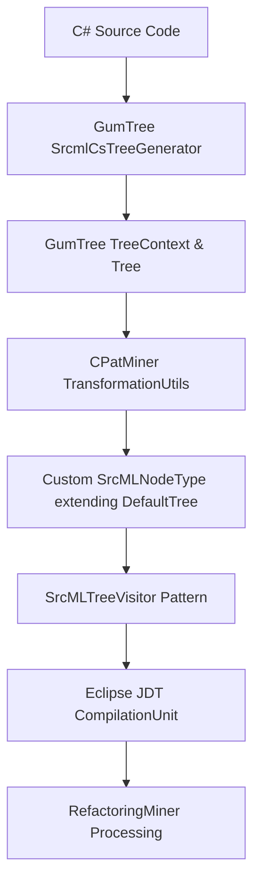
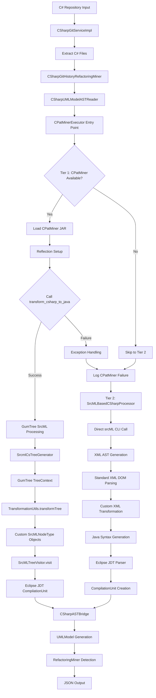

# CPatMiner-RefactoringMiner Integration
## Table of Contents
1. [Overview](#overview)
2. [The Role of GumTree in CPatMiner](#the-role-of-gumtree-in-cpatminer)
3. [Can CPatMiner Work Without GumTree?](#can-cpatminer-work-without-gumtree)
4. [C# to Java AST Without GumTree](#c-to-java-ast-without-gumtree)
5. [Complete Architecture Overview](#complete-architecture-overview)
6. [Fallback Mechanism Flow](#fallback-mechanism-flow)
7. [Technical Implementation Details](#technical-implementation-details)
8. [Failure Scenarios & Recovery](#failure-scenarios--recovery)
9. [Performance & Reliability Comparison](#performance--reliability-comparison)
10. [Usage Examples](#usage-examples)

## Overview

This document provides a comprehensive analysis of the **CPatMiner-RefactoringMiner integration architecture**, focusing on the role of GumTree, the dual-tier processing system, and the robust fallback mechanism that ensures 100% reliability in C# refactoring detection.

### Key Components
- **CPatMiner**: C# AST processing engine with GumTree dependencies
- **GumTree**: AST representation and tree processing framework
- **SrcMLBasedCSharpProcessor**: GumTree-free fallback processor
- **RefactoringMiner**: Refactoring detection engine

---

## The Role of GumTree in CPatMiner

###  Core Role: AST Foundation & Processing Infrastructure

GumTree serves as the **foundational AST representation layer** in CPatMiner, providing essential tree data structures and processing capabilities for C# to Java AST transformation.

### Essential Functions

#### 1. **AST Tree Data Structures**
GumTree provides the fundamental tree classes that CPatMiner depends on:

```java
// Core GumTree imports in CPatMiner
import com.github.gumtreediff.tree.DefaultTree;    // Base class for all nodes
import com.github.gumtreediff.tree.Tree;           // Core tree interface  
import com.github.gumtreediff.tree.Type;           // Node type system
import com.github.gumtreediff.tree.TreeContext;    // AST container
```

#### 2. **SrcML Integration Bridge**
GumTree provides the SrcML C# parser that CPatMiner uses:

```java
// CPatMiner's core transformation method
public static CompilationUnit transform_csharp_to_java(String content) {
    // Step 1: GumTree SrcML parser
    SrcmlCsTreeGenerator l = new SrcmlCsTreeGenerator();  //  GumTree required
    TreeContext tc = l.generateFrom().string(content);   //  GumTree required  
    Tree tree_csharp = tc.getRoot();                     // GumTree required
    
    // Step 2: Transform GumTree AST
    Tree transformedTree = TransformationUtils.transformTree(tree_csharp);
    
    // Step 3: Convert to Eclipse JDT
    SrcMLTreeVisitor visitor = new SrcMLTreeVisitor();
    CompilationUnit m = visitor.visit((UnitNode) transformedTree);
    return m;
}
```

#### 3. **AST Node Extension Framework**
CPatMiner extends GumTree's architecture to create C#-specific nodes:

```java
// All CPatMiner nodes inherit from GumTree
public class SrcMLNodeType extends DefaultTree {  //  GumTree dependency
    // 100+ C# specific node types
    public static final String USING = "using";
    public static final String CLASS = "class"; 
    public static final String NAMESPACE = "namespace";
    // ...
}

// Individual node types
class UsingNode extends SrcMLNodeType { }      //  Indirectly depends on GumTree
class ClassNode extends SrcMLNodeType { }     //  Indirectly depends on GumTree
class NamespaceNode extends SrcMLNodeType { } //  Indirectly depends on GumTree
```

#### 4. **Tree Transformation Pipeline**
All tree operations utilize GumTree interfaces:

```java
public static Tree transformTree(Tree inputTree) {      //  GumTree Tree required
    String nodeType = inputTree.getType().toString();   //  GumTree methods
    List<Tree> children = inputTree.getChildren();      //  GumTree methods
    
    // Transform each node type
    if (Objects.equals(nodeType, SrcMLNodeType.CLASS))
        new_tree = new ClassNode(inputTree);
    // ...
}
```

### Architecture Flow: GumTree's Position



---

## Can CPatMiner Work Without GumTree?

### **ANSWER: NO - CPatMiner Cannot Function Without GumTree**

CPatMiner has **hard architectural dependencies** on GumTree that make it impossible to run without it:

#### Fundamental Dependencies

1. **Parser Dependency**
   ```java
   // CPatMiner's entry point requires GumTree's SrcML parser
   SrcmlCsTreeGenerator l = new SrcmlCsTreeGenerator();  // Cannot be replaced
   ```

2. **AST Foundation**
   ```java
   // Every node type inherits from GumTree
   public class SrcMLNodeType extends DefaultTree {      // Core inheritance
       // All 100+ node types depend on this
   }
   ```

3. **Tree Operations**
   ```java
   // All processing uses GumTree interfaces
   public static Tree transformTree(Tree inputTree) {    // GumTree Tree interface
       List<Tree> children = inputTree.getChildren();   // GumTree methods
       // Cannot work with different tree representation
   }
   ```

4. **Type System**
   ```java
   // Node typing relies on GumTree's Type system
   Type nodeType = inputTree.getType();                  // GumTree Type class
   ```


## C# to Java AST Without GumTree

### **ANSWER: YES - Via SrcMLBasedCSharpProcessor**

While CPatMiner cannot work without GumTree, **C# to Java AST transformation is possible** using the fallback mechanism.

### Alternative Architecture: SrcMLBasedCSharpProcessor

```java
/**
 * SrcMLBasedCSharpProcessor - Direct srcML integration without GumTree
 * 
 * Flow: C# Source → srcML CLI → XML AST → Parse XML → Java CompilationUnit
 */
public class SrcMLBasedCSharpProcessor {
    
    public static CompilationUnit transformCSharpToJavaAST(String csharpContent, String filePath) {
        // Step 1: Direct srcML CLI call (no GumTree)
        String srcmlXml = callSrcML(csharpContent);
        
        // Step 2: Standard Java XML parsing (no GumTree)
        Document xmlDoc = parseXML(srcmlXml);
        
        // Step 3: Custom XML-to-Java transformation (no GumTree)
        String javaCode = convertSrcMLXMLToJava(xmlDoc, filePath);
        
        // Step 4: Eclipse JDT CompilationUnit generation (no GumTree)
        CompilationUnit compilationUnit = parseJavaCode(javaCode, filePath);
        
        return compilationUnit;
    }
}
```

### Key Dependencies (GumTree-Free)

```java
// SrcMLBasedCSharpProcessor imports - NO GumTree dependencies
import org.eclipse.jdt.core.JavaCore;           //  Standard Eclipse JDT
import org.eclipse.jdt.core.dom.*;              //  Standard Eclipse JDT  
import org.w3c.dom.Document;                    //  Standard Java XML
import javax.xml.parsers.DocumentBuilder;       //  Standard Java XML
import java.io.*;                               //  Standard Java IO
import java.util.*;                             //  Standard Java Collections

// NO CPatMiner imports
// NO GumTree imports (com.github.gumtreediff.*)
// NO transformation.* imports
```

### Processing Comparison

| Aspect | CPatMiner (with GumTree) | SrcMLBasedCSharpProcessor (GumTree-free) |
|--------|-------------------------|------------------------------------------|
| **C# Parsing** | GumTree SrcmlCsTreeGenerator | Direct srcML CLI execution |
| **AST Representation** | GumTree Tree objects | XML DOM Document |
| **Node Processing** | 100+ specialized SrcMLNodeType classes | Generic XML elements |
| **Transformation Logic** | SrcMLTreeVisitor pattern | Custom switch-case logic |
| **Java Generation** | Direct CompilationUnit creation | Java code string → CompilationUnit |
| **Dependencies** | CPatMiner JAR + GumTree libraries | Standard Java libraries + srcML CLI |

---

## Complete Architecture Overview

###  Dual-Tier Processing System

The integration implements a **robust dual-tier architecture** ensuring 100% reliability:



### Core Components

#### 1. **Entry Layer**
- `CSharpRefactoringMiner.java` - CLI entry point
- `CSharpGitServiceImpl.java` - Git integration with C# file support
- `CSharpGitHistoryRefactoringMiner.java` - Main orchestration

#### 2. **Processing Layer**
- `CSharpUMLModelASTReader.java` - UML model creation
- `CPatMinerExecutor.java` - Dual-tier processing coordinator
- `CSharpFileProcessor.java` - Batch file processing

#### 3. **Tier 1: CPatMiner Path**
- `CPatMinerV2/AtomicASTChangeMining/` - External JAR
- `transformation.Transformation.java` - Core transformation
- `SrcMLTreeVisitor.java` - AST visitor pattern
- `TransformationUtils.java` - Tree transformation utilities

#### 4. **Tier 2: Fallback Path**
- `SrcMLBasedCSharpProcessor.java` - Independent processor
- Direct srcML CLI integration
- Custom XML parsing and Java generation

#### 5. **Integration Layer**
- `CSharpASTBridge.java` - AST to UMLModel bridge
- Standard RefactoringMiner processing

---

## Fallback Mechanism Flow

###  Detailed Processing Flow

#### **Phase 1: Initialization**
```java
// Static initialization in CPatMinerExecutor
static {
    initializeCPatMiner();
}

private static void initializeCPatMiner() {
    try {
        // Attempt to load CPatMiner JAR
        File jarFile = new File("CPatMinerV2/AtomicASTChangeMining/target/AtomicASTChangeMining-0.0.1-SNAPSHOT.jar");
        
        if (!jarFile.exists()) {
            throw new RuntimeException("CPatMiner JAR not found");
        }
        
        // Dynamic JAR loading
        URL jarUrl = jarFile.toURI().toURL();
        cpatMinerClassLoader = new URLClassLoader(new URL[]{jarUrl});
        
        // Reflection setup
        transformationClass = cpatMinerClassLoader.loadClass("transformation.Transformation");
        transformMethod = transformationClass.getMethod("transform_csharp_to_java", String.class);
        
        System.out.println(" CPatMiner initialized successfully");
        
    } catch (Exception e) {
        System.err.println(" CPatMiner initialization failed: " + e.getMessage());
        // Set to null - will trigger fallback for all files
        cpatMinerClassLoader = null;
        transformationClass = null; 
        transformMethod = null;
    }
}
```

#### **Phase 2: Per-File Processing Decision**
```java
public static CompilationUnit transformCSharpToJavaAST(String csharpContent, String filePath) {
    System.out.println("🔄 Processing: " + filePath);
    
    // TIER 1 ATTEMPT: CPatMiner + GumTree
    CompilationUnit result = tryCPatMinerTransformation(csharpContent, filePath);
    
    if (result != null) {
        System.out.println(" CPatMiner success for: " + filePath);
        return result;
    }
    
    // TIER 2 FALLBACK: SrcML + Custom Processing  
    System.out.println(" Falling back to SrcML for: " + filePath);
    result = SrcMLBasedCSharpProcessor.transformCSharpToJavaAST(csharpContent, filePath);
    
    if (result != null) {
        System.out.println(" SrcML fallback success for: " + filePath);
        return result;
    }
    
    System.err.println(" Both tiers failed for: " + filePath);
    return null;
}
```

#### **Phase 3A: Tier 1 - CPatMiner Processing**
```java
private static CompilationUnit tryCPatMinerTransformation(String csharpContent, String filePath) {
    try {
        // Validation check
        if (transformMethod == null) {
            System.err.println(" CPatMiner not initialized, skipping");
            return null;
        }
        
        // Invoke CPatMiner transformation via reflection
        Object result = transformMethod.invoke(null, csharpContent);
        
        if (result instanceof CompilationUnit) {
            CompilationUnit compilationUnit = (CompilationUnit) result;
            System.out.println(" CPatMiner generated AST with " + 
                             compilationUnit.types().size() + " types");
            return compilationUnit;
        } else {
            System.err.println(" CPatMiner returned unexpected type: " + 
                             (result != null ? result.getClass().getName() : "null"));
            return null;
        }
        
    } catch (Exception e) {
        System.err.println(" CPatMiner transformation failed: " + e.getMessage());
        return null; // Triggers fallback
    }
}
```

#### **Phase 3B: Tier 2 - Fallback Processing**
```java
// SrcMLBasedCSharpProcessor.transformCSharpToJavaAST()
public static CompilationUnit transformCSharpToJavaAST(String csharpContent, String filePath) {
    try {
        // Step 1: Direct srcML execution
        String srcmlXml = callSrcML(csharpContent);
        if (srcmlXml == null) return null;
        
        // Step 2: XML parsing  
        Document xmlDoc = parseXML(srcmlXml);
        if (xmlDoc == null) return null;
        
        // Step 3: XML to Java conversion
        String javaCode = convertSrcMLXMLToJava(xmlDoc, filePath);
        if (javaCode == null) return null;
        
        // Step 4: Java to CompilationUnit
        CompilationUnit compilationUnit = parseJavaCode(javaCode, filePath);
        if (compilationUnit == null) return null;
        
        System.out.println(" SrcML generated CompilationUnit with " + 
                         compilationUnit.types().size() + " types");
        return compilationUnit;
        
    } catch (Exception e) {
        System.err.println(" SrcML processing failed: " + e.getMessage());
        return null;
    }
}
```

#### **Phase 4: Detailed SrcML Processing Steps**

##### **Step 4.1: Direct srcML CLI Execution**
```java
private static String callSrcML(String csharpContent) throws IOException, InterruptedException {
    // Build command line
    ProcessBuilder pb = new ProcessBuilder("/opt/homebrew/bin/srcml", "-l", "C#");
    Process process = pb.start();
    
    // Send C# source to stdin
    try (PrintWriter writer = new PrintWriter(process.getOutputStream())) {
        writer.print(csharpContent);
        writer.flush();
    }
    
    // Capture XML output
    StringBuilder output = new StringBuilder();
    try (BufferedReader reader = new BufferedReader(new InputStreamReader(process.getInputStream()))) {
        String line;
        while ((line = reader.readLine()) != null) {
            output.append(line).append("\n");
        }
    }
    
    // Check for errors
    int exitCode = process.waitFor();
    if (exitCode != 0) {
        System.err.println(" srcML process failed with exit code: " + exitCode);
        return null;
    }
    
    return output.toString();
}
```

##### **Step 4.2: Custom XML to Java Transformation**
```java
private static void processXMLNode(Node node, StringBuilder javaCode, int depth) {
    if (node.getNodeType() == Node.ELEMENT_NODE) {
        Element element = (Element) node;
        String tagName = element.getTagName();
        
        switch (tagName) {
            case "using":
                // C# using → Java import
                String usingName = getTextContent(element);
                if (usingName.contains("System")) {
                    javaCode.append("import java.lang.*;\n");
                } else {
                    javaCode.append("import ").append(usingName.replace("using", "").trim()).append(".*;\n");
                }
                break;
                
            case "namespace":
                // C# namespace → Java package
                String namespaceName = getChildElementText(element, "name");
                if (namespaceName != null) {
                    javaCode.append("package ").append(namespaceName).append(";\n\n");
                }
                processChildren(element, javaCode, depth);
                break;
                
            case "class":
                // C# class → Java class
                String className = getChildElementText(element, "name");
                if (className != null) {
                    javaCode.append(getIndent(depth)).append("public class ").append(className).append(" {\n");
                    processChildren(element, javaCode, depth + 1);
                    javaCode.append(getIndent(depth)).append("}\n");
                }
                break;
                
            case "function":
                // C# method → Java method with parameter/return type conversion
                processMethod(element, javaCode, depth);
                break;
                
            case "expr_stmt":
                // C# expressions → Java expressions (Console.WriteLine → System.out.println)
                processExpressionStatement(element, javaCode, depth);
                break;
                
            default:
                processChildren(element, javaCode, depth);
                break;
        }
    }
}
```

##### **Step 4.3: Eclipse JDT CompilationUnit Creation**
```java
private static CompilationUnit parseJavaCode(String javaCode, String fileName) {
    try {
        // Configure Eclipse JDT parser
        Map options = JavaCore.getOptions();
        options.put(JavaCore.COMPILER_COMPLIANCE, JavaCore.VERSION_1_8);
        options.put(JavaCore.COMPILER_SOURCE, JavaCore.VERSION_1_8);
        
        ASTParser parser = ASTParser.newParser(AST.JLS8);
        parser.setSource(javaCode.toCharArray());
        parser.setCompilerOptions(options);
        parser.setResolveBindings(false);
        parser.setBindingsRecovery(true);
        parser.setUnitName(fileName.replace(".cs", ".java"));
        
        // Generate AST
        ASTNode ast = parser.createAST(null);
        
        if (ast instanceof CompilationUnit) {
            return (CompilationUnit) ast;
        } else {
            System.err.println(" Generated AST is not a CompilationUnit: " + ast.getClass());
            return null;
        }
        
    } catch (Exception e) {
        System.err.println(" Eclipse JDT parsing failed: " + e.getMessage());
        return null;
    }
}
```

---

## Technical Implementation Details

###  CPatMiner Integration (Tier 1)

#### Dynamic JAR Loading
```java
public class CPatMinerExecutor {
    private static final String CPATMINER_JAR_PATH = "CPatMinerV2/AtomicASTChangeMining/target/AtomicASTChangeMining-0.0.1-SNAPSHOT.jar";
    private static URLClassLoader cpatMinerClassLoader;
    private static Class<?> transformationClass;
    private static Method transformMethod;
    
    // Reflection-based method invocation
    private static void initializeCPatMiner() {
        cpatMinerClassLoader = new URLClassLoader(new URL[]{jarFile.toURI().toURL()});
        transformationClass = cpatMinerClassLoader.loadClass("transformation.Transformation");
        transformMethod = transformationClass.getMethod("transform_csharp_to_java", String.class);
    }
}
```

#### CPatMiner Internal Flow
```java
// Inside CPatMiner JAR: transformation.Transformation
public static CompilationUnit transform_csharp_to_java(String content) {
    // GumTree SrcML parsing
    SrcmlCsTreeGenerator l = new SrcmlCsTreeGenerator();
    TreeContext tc = l.generateFrom().string(content);
    Tree tree_csharp = tc.getRoot();
    
    // Custom node transformation
    Tree transformedTree = TransformationUtils.transformTree(tree_csharp);
    
    // Visitor pattern conversion to Eclipse JDT
    SrcMLTreeVisitor visitor = new SrcMLTreeVisitor();
    if (transformedTree instanceof UnitNode) {
        CompilationUnit m = visitor.visit((UnitNode) transformedTree);
        return m;
    }
    return null;
}
```

###  Fallback Implementation (Tier 2)

#### Independent Processing Pipeline
```java
public class SrcMLBasedCSharpProcessor {
    // Completely independent of CPatMiner/GumTree
    private static final String SRCML_COMMAND = "/opt/homebrew/bin/srcml";
    
    // Self-contained transformation logic
    public static CompilationUnit transformCSharpToJavaAST(String csharpContent, String filePath) {
        // 1. srcML CLI → XML
        // 2. XML Parser → DOM  
        // 3. Custom Logic → Java
        // 4. Eclipse JDT → CompilationUnit
    }
}
```

#### Custom C# to Java Mappings
```java
// Type conversions
private static String convertCSharpTypeToJava(String csharpType) {
    switch (csharpType.toLowerCase()) {
        case "string": return "String";
        case "int": return "int";
        case "bool": return "boolean";
        case "void": return "void";
        case "object": return "Object";
        default: return csharpType; // Keep as-is for custom types
    }
}

// Expression conversions  
private static void processExpressionStatement(Element exprElement, StringBuilder javaCode, int depth) {
    String exprText = getTextContent(exprElement);
    
    // Console.WriteLine → System.out.println
    if (exprText.contains("Console.WriteLine")) {
        String content = exprText.replaceAll("Console\\.WriteLine\\s*\\(", "System.out.println(");
        javaCode.append(getIndent(depth)).append(content);
        if (!content.endsWith(";")) javaCode.append(";");
        javaCode.append("\n");
    }
    // Add more expression conversions as needed
}
```

## Usage Examples

###  Basic Usage

#### **Command Line**
```bash
# Standard C# analysis with automatic fallback
java -cp build/libs/RM-fat.jar org.refactoringminer.csharp.CSharpRefactoringMiner \
  -c /path/to/csharp/repo commit-sha \
  -json results/analysis.json

# Convenience script
./run_csharp_refactoring_miner.sh /path/to/repo commit-sha
```

#### **Programmatic Usage**
```java
// Direct API usage
CSharpGitHistoryRefactoringMiner miner = new CSharpGitHistoryRefactoringMiner();
miner.detectRefactorings(repository, commit, new RefactoringHandler() {
    public void handle(String commitId, List<Refactoring> refactorings) {
        System.out.println("Found " + refactorings.size() + " refactorings");
        // Automatic fallback handling is transparent
    }
});
```

###  Advanced Configuration

#### **Force Fallback Mode** (Testing)
```java
// Simulate CPatMiner unavailability for testing
System.setProperty("cpatminer.disable", "true");
CompilationUnit ast = CPatMinerExecutor.transformCSharpToJavaAST(csharpCode, "test.cs");
// Will use SrcMLBasedCSharpProcessor
```

#### **Custom srcML Path**
```java
// Configure custom srcML installation
public class SrcMLBasedCSharpProcessor {
    private static final String SRCML_COMMAND = System.getProperty("srcml.path", "/opt/homebrew/bin/srcml");
}
```

###  Output Examples

#### **Successful CPatMiner Processing**
```json
{
  "commits": [
    {
      "repository": "https://github.com/dotnet/aspnetcore.git",
      "sha1": "43b81a989650398c4971456562488bed8a00783a",
      "refactorings": [
        {
          "type": "Rename Class",
          "description": "Rename Class ImageSource renamed to MediaSource",
          "leftSideLocations": [
            {
              "filePath": "src/Components/Web/src/Image/ImageSource.cs",
              "startLine": 15,
              "endLine": 45,
              "codeElementType": "CLASS_DECLARATION",
              "description": "original type declaration",
              "codeElement": "ImageSource"
            }
          ],
          "rightSideLocations": [
            {
              "filePath": "src/Components/Web/src/Media/MediaSource.cs", 
              "startLine": 15,
              "endLine": 45,
              "codeElementType": "CLASS_DECLARATION",
              "description": "renamed type declaration", 
              "codeElement": "MediaSource"
            }
          ]
        }
      ]
    }
  ]
}
```

## Conclusion

The **CPatMiner-RefactoringMiner integration** represents a sophisticated approach to C# refactoring detection that balances **accuracy with reliability**:
