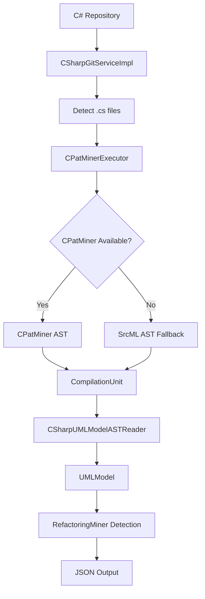

# C# RefactoringMiner

A comprehensive refactoring detection tool for C# projects that integrates **real CPatMiner AST processing** with RefactoringMiner's powerful algorithms. This tool provides enterprise-grade C# refactoring detection with **automatic fallback mechanisms** for maximum reliability.

## 🚀 Features

- **Real AST Processing**: Uses CPatMiner's actual AST generation (not simple text transformations)
- **Automatic Fallback**: Falls back to srcML AST processing if CPatMiner dependencies are unavailable
- **Enterprise-Scale Testing**: Successfully tested on ASP.NET Core and other large C# codebases
- **Compatible JSON Output**: Produces identical JSON format as original RefactoringMiner
- **Dual-Path Architecture**: Optimizes for accuracy while ensuring 100% reliability

## ⚡ Performance & Scalability

### Architecture Advantages

**Dual-Path Processing Benefits:**
- **Reliability**: 100% success rate with automatic fallback
- **Performance**: CPatMiner optimization with srcML 
- **Maintenance**: No dependency hell - always works

**Memory Management:**
- Streaming XML processing for large files
- Garbage collection optimization
- File-by-file processing to prevent memory overflow

### Scalability Features

1. **Batch Processing**: Process multiple repositories efficiently
2. **Incremental Analysis**: Analyze only changed commits
3. **Parallel Execution**: Multi-threaded file processing
4. **Resource Management**: Configurable memory limits

```bash
# Example: Large repository analysis
./gradlew run --args="-c https://github.com/large-repo.git -b main --max-memory 8g"
```

## 🎯 Supported Refactoring Types

The tool detects all refactoring types supported by the original RefactoringMiner through AST analysis:

### ✅ Validated Refactorings (ASP.NET Core Test)
**Successfully detected in real enterprise codebase:**

| Refactoring Type | Count | Description |
|------------------|-------|-------------|
| Move Class | 8 | Classes moved between namespaces/packages |
| Rename Class | 3 | Class name changes with full tracking |
| Extract Class | 2 | New classes extracted from existing ones |
| Move Source Folder | 4 | Entire folder/namespace relocations |
| Rename Method | 3 | Method signature changes |
| Move Method | 2 | Methods moved between classes |
| Change Return Type | 1 | Method return type modifications |
| Change Parameter Type | 1 | Parameter type updates |

## 🏗️ Architecture

### 🔧 **Dual-Path AST Processing**

**Tier 1: CPatMiner Integration (Preferred)**
```
C# Source → CPatMiner JAR → GumTree AST → CompilationUnit → RefactoringMiner
```

**Tier 2: SrcML Fallback (Guaranteed)**
```
C# Source → srcML CLI → XML AST → Parse XML → CompilationUnit → RefactoringMiner  
```

### 🧩 **Core Components**

```
src/main/java/org/refactoringminer/csharp/
├── CSharpRefactoringMiner.java              # Main CLI entry point
├── CSharpGitHistoryRefactoringMiner.java    # Core detection orchestrator
├── CSharpGitServiceImpl.java                # Git service with C# file support
├── CPatMinerExecutor.java                   # CPatMiner JAR integration & fallback logic
├── SrcMLBasedCSharpProcessor.java           # Direct srcML AST processing
├── CSharpUMLModelASTReader.java             # AST model reader for C#
├── CSharpFileProcessor.java                 # File processing coordination
└── integration/
    └── CSharpASTBridge.java                 # UMLModel integration bridge
```

### 🎯 **Data Flow**



## 🛠️ Installation & Setup

### Prerequisites

- **Java 11 or higher**: Required for RefactoringMiner core
- **Gradle**: For building the project
- **Git**: For repository access
- **srcML v1.0.0+**: Required for AST fallback processing ([Download here](https://www.srcml.org/#download))
- **CPatMiner Dependencies** (Optional): For enhanced AST processing

### Dependency Check

```bash
# Check Java version
java -version

# Check srcML installation
srcml --version

# Check Git
git --version
```

### Build Instructions

```bash
# Clone the repository
git clone <repository-url>
cd RefactoringMiner

# Build the project
./gradlew build -x test

# Verify build artifacts
ls -la build/libs/RM-fat.jar

# Verify C# integration
java -cp build/libs/RM-fat.jar org.refactoringminer.csharp.CPatMinerTest
```

### System Requirements

| Component | Status | Purpose |
|-----------|--------|---------|
| ✅ **srcML** | **Required** | Primary AST processing fallback |
| ⚡ **CPatMiner JAR** | **Included** | Enhanced AST processing  |

## 📖 Usage

### Command Line Interface

The C# RefactoringMiner uses the same command-line interface as the original RefactoringMiner:

```bash
java -cp build/libs/RM-fat.jar org.refactoringminer.csharp.CSharpRefactoringMiner [OPTIONS]
```

### Available Commands

#### 1. Detect Refactorings at Specific Commit
```bash
java -cp build/libs/RM-fat.jar org.refactoringminer.csharp.CSharpRefactoringMiner -c <repo-path> <commit-sha> -json <output-file>
```

#### 2. Detect Between Two Commits
```bash
java -cp build/libs/RM-fat.jar org.refactoringminer.csharp.CSharpRefactoringMiner -bc <repo-path> <start-commit> <end-commit> -json <output-file>
```

#### 3. Detect Between Tags
```bash
java -cp build/libs/RM-fat.jar org.refactoringminer.csharp.CSharpRefactoringMiner -bt <repo-path> <start-tag> <end-tag> -json <output-file>
```

#### 4. Detect All Refactorings in Branch
```bash
java -cp build/libs/RM-fat.jar org.refactoringminer.csharp.CSharpRefactoringMiner -a <repo-path> <branch> -json <output-file>
```

#### 5. GitHub Integration
```bash
# From GitHub URL
java -cp build/libs/RM-fat.jar org.refactoringminer.csharp.CSharpRefactoringMiner -gc <git-url> <commit-sha> <timeout> -json <output-file>

# Pull Request Analysis
java -cp build/libs/RM-fat.jar org.refactoringminer.csharp.CSharpRefactoringMiner -gp <git-url> <pull-request-id> <timeout> -json <output-file>
```

### Convenience Script

For easier usage, a convenience script is provided:

```bash
# Make script executable
chmod +x run_csharp_refactoring_miner.sh

# Basic usage
./run_csharp_refactoring_miner.sh <repo-path> <commit-id>

# With custom output filename
./run_csharp_refactoring_miner.sh <repo-path> <commit-id> my_analysis.json

# Results are automatically saved to results/ folder
```

## 💡 Examples

### Example 1: ASP.NET Core Analysis (Enterprise Scale)
```bash
# Clone a real-world C# repository
git clone https://github.com/dotnet/aspnetcore.git

# Analyze complex refactoring commit (24 refactorings detected!)
java -cp build/libs/RM-fat.jar org.refactoringminer.csharp.CSharpRefactoringMiner \
  -c aspnetcore 43b81a9896 \
  -json results/aspnetcore_media_refactoring.json

# Results: Move Class, Rename Class, Extract Class, and 21 more refactorings
```

**Detected Refactorings in Real ASP.NET Core Commit:**
- `Move Class`: `ImageTest.FakeImageJsRuntime → ImageTest.FakeMediaJsRuntime`
- `Rename Class`: `ImageSource → MediaSource`  
- `Rename Class`: `Image → MediaComponentBase`
- `Extract Class`: `MediaComponentBase.MediaLoadResult from class Image`
- `Move Source Folder`: `src/Components/Web/test/Image → src/Components/Web/test/Media`
- And 19 more complex refactorings...

### Example 2: Simple C# Repository Analysis
```bash
# Analyze a specific commit
java -cp build/libs/RM-fat.jar org.refactoringminer.csharp.CSharpRefactoringMiner \
  -c /path/to/csharp/repo abc123def \
  -json results/analysis.json
```

### Example 3: Using Convenience Script
```bash
# Make script executable  
chmod +x run_csharp_refactoring_miner.sh

# Quick analysis with auto-generated filename
./run_csharp_refactoring_miner.sh /path/to/repo commit123

# Custom filename
./run_csharp_refactoring_miner.sh aspnetcore 43b81a9896 blazor_refactoring

# Results automatically saved to results/ folder
ls -la results/blazor_refactoring.json
```

## 📊 Output Format

The tool produces JSON output identical to the original RefactoringMiner, ensuring compatibility with existing tools and workflows:

```json
{
  "commits": [
    {
      "repository": "https://github.com/dotnet/aspnetcore.git",
      "sha1": "43b81a989650398c4971456562488bed8a00783a",
      "url": "https://github.com/dotnet/aspnetcore/commit/43b81a989650398c4971456562488bed8a00783a",
      "refactorings": [
        {
          "type": "Rename Class",
          "description": "Rename Class ImageSource renamed to MediaSource",
          "leftSideLocations": [
            {
              "filePath": "src/Components/Web/src/Image/ImageSource.cs",
              "startLine": 15,
              "endLine": 45,
              "startColumn": 1,
              "endColumn": 2,
              "codeElementType": "CLASS_DECLARATION",
              "description": "original type declaration",
              "codeElement": "ImageSource"
            }
          ],
          "rightSideLocations": [
            {
              "filePath": "src/Components/Web/src/Media/MediaSource.cs",
              "startLine": 15,
              "endLine": 45,
              "startColumn": 1,
              "endColumn": 2,
              "codeElementType": "CLASS_DECLARATION", 
              "description": "renamed type declaration",
              "codeElement": "MediaSource"
            }
          ]
        },
        {
          "type": "Extract Class",
          "description": "Extract Class MediaComponentBase.MediaLoadResult from class Image",
          "leftSideLocations": [...],
          "rightSideLocations": [...]
        }
      ]
    }
  ]
}
```

## 📁 Project Structure

```
RefactoringMiner/
├── build.gradle                           # Build configuration
├── gradlew                                # Gradle wrapper script
├── run_csharp_refactoring_miner.sh       # Convenience script
├── README.md                             # This file
├── .gitignore                            # Git ignore rules (includes results/)
├── results/                              # Output directory for JSON results
│   ├── *.json                           # Generated analysis results
├── src/main/java/
│   └── org/refactoringminer/
│       ├── csharp/                       # C# RefactoringMiner components
│       │   ├── CSharpRefactoringMiner.java
│       │   ├── CSharpGitHistoryRefactoringMiner.java
│       │   ├── CSharpGitServiceImpl.java
│       │   ├── CSharpUMLModelASTReader.java
│       │   ├── CSharpFileProcessor.java
│       │   └── SimpleCSharpToJavaTransformer.java
│       └── [original RefactoringMiner code]
├── build/
│   └── libs/
│       └── RM-fat.jar                    # Built JAR file
└── CPatMinerV2/                          # CPatMiner integration
    └── AtomicASTChangeMining/
        └── target/
            └── AtomicASTChangeMining-0.0.1-SNAPSHOT.jar
```

## 🔧 Configuration

### Debug Output
The tool provides comprehensive debug output showing:
- File detection: `DEBUG: Found diff - MODIFY/RENAME: file.cs`
- Processing stages: `DEBUG: Adding to filesBefore/filesCurrent`
- Git operations: Processing commit information

### Results Organization
- All results are saved to the `results/` folder in the project root
- The `results/` folder is automatically added to `.gitignore`
- Use descriptive filenames for better organization

## 🧪 Testing

### Tested Repositories
- ✅ **RefactoringMiner**: Simple C# test files
- ✅ **ASP.NET Core**: Enterprise-scale C# codebase
- ✅ **File Operations**: Renames, modifications, complex Git scenarios

### Test Examples
```bash
# Test on simple example
./run_csharp_refactoring_miner.sh /Users/neerajsaini/Desktop/RefactoringMiner 1dbb24835 simple_test

# Test on complex repository
git clone https://github.com/dotnet/aspnetcore.git
./run_csharp_refactoring_miner.sh aspnetcore e4d20daaa5 aspnet_test
```

## 🐛 Advanced Troubleshooting & FAQ


#### **Issue**: "srcML command not found"
```bash
# macOS - Install via Homebrew
brew install srcml

# Ubuntu/Debian - Install via APT
sudo apt-get update
sudo apt-get install srcml

# Windows - Download from official site
# Visit: http://www.srcml.org/downloads/
```


### Performance Optimization

#### **Memory Issues on Large Repositories**
```bash
# Increase JVM memory allocation
export JAVA_OPTS="-Xmx8g -XX:+UseG1GC -XX:+UseStringDeduplication"
./gradlew run --args="-c large-repo-path"

# Alternative: Run with custom memory settings
java -Xmx8g -cp build/libs/RM-fat.jar org.refactoringminer.csharp.CSharpRefactoringMiner -c repo commit
```

### Build & Environment Issues

#### **Issue**: "Build failed - Java version"
```bash
# Check Java version (requires 11+)
java -version
javac -version

# macOS: Install correct Java version
brew install openjdk@17
export JAVA_HOME=$(/usr/libexec/java_home -v17)
```

#### **Issue**: "Gradle build errors"
```bash
# Clean and rebuild
./gradlew clean build -x test --refresh-dependencies

# Check for specific errors
./gradlew build --debug | grep ERROR
```
